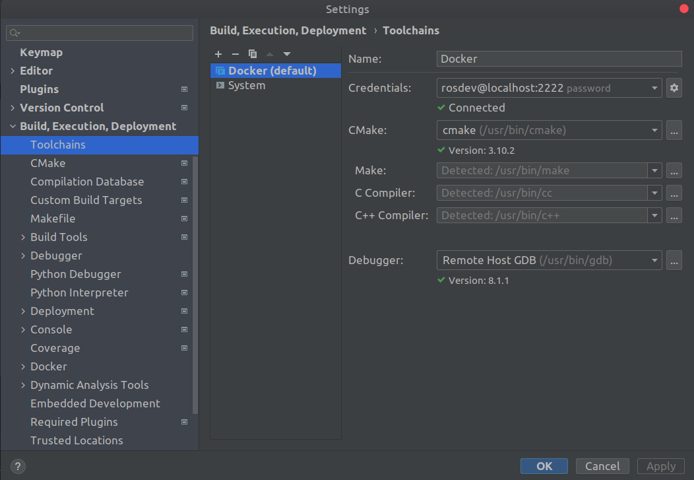
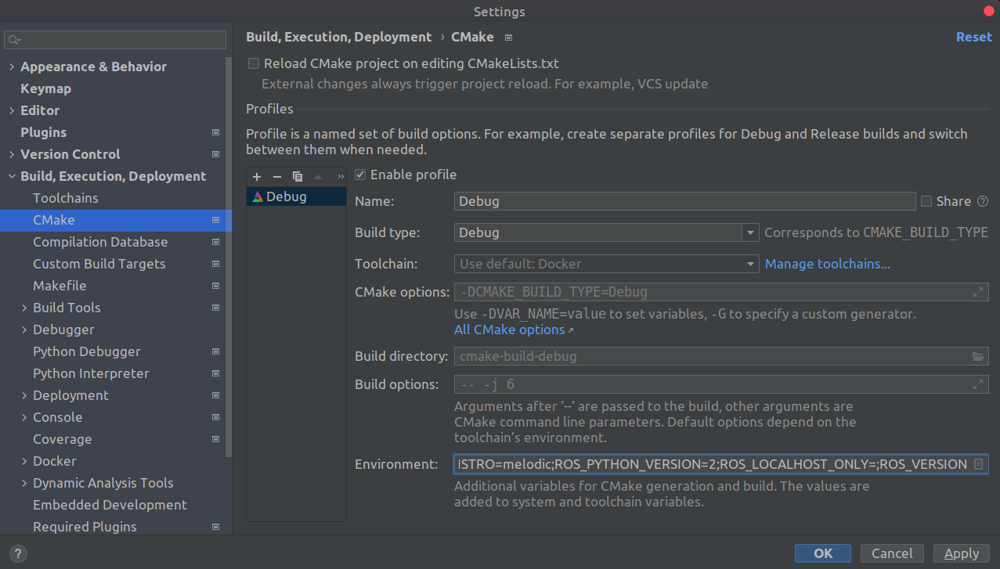
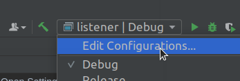
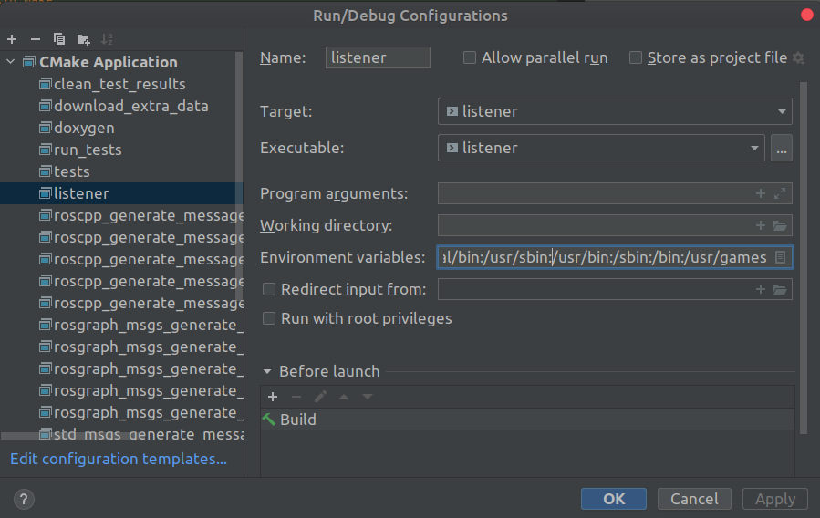

# ros-docker-clion

Workflow merging the Holy Trinity - ROS + Docker + CLion IDE. Creates a sandbox environment for building and testing ROS projects.

**But why I hear you ask. Here are my reasons:**
1. I cannot stand VMs
2. Working on multiple projects each using different ROS distros, I am done dual booting and copying dotfiles, creating GitHub pipelines and manually setting up docker environments with no code completions and hints ;-;
3. Well that's pretty much it.

Feel free to not use it.

Improvements and suggestions are always welcome.

## Steps

### Install Docker
  - [Official Installation guide](https://docs.docker.com/engine/install/)

### Build the images

A sample Dockerfile that configures an SSH daemon for CLion can be found [here](docker/sandbox.Dockerfile).
To build the image, run

```bash
docker-compose build
```

### Start services

- Run the containers

```bash
docker-compose up
```

This creates a sandbox environment into which the `src` directory is mounted as the catkin workspace `src` directory.

You can now SSH into the sandbox environment and make sure everything is working properly.

```bash
ssh rosdev@localhost -p 2222
```

If you change your settings later or have ssh'ed into a host with similar settings before, clear SSH cache with

```bash
ssh-keygen -f "$HOME/.ssh/known_hosts" -R "[localhost]:2222"
```

### Setup CLion

- Open Settings in CLion and add a new remote toolchain. Give it a name (say Docker) and use the credentials 
  used in the Dockerfile for SSH.
  


5. Setup workspace

We need to fetch the required environment variables for remote builds and running binaries.

- SSH into the environment and trigger a catkin build

```bash
ssh rosdev@localhost -p 2222
cd /home/rosdev/catkin_ws
. /opt/ros/melodic/setup.sh
catkin_make
. devel/setup.sh
```
NOTE: You can use Bash instead of the default shell sh, in that case source the corresponding setup scripts.

- Run the following script to fetch the environment variables.
```bash
ros_env="ROS_ROOT ROS_MASTER_URI ROS_PACKAGE_PATH CMAKE_PREFIX_PATH PKG_CONFIG_PATH PYTHONPATH LD_LIBRARY_PATH PATH ROS_DISTRO ROS_PYTHON_VERSION ROS_LOCALHOST_ONLY ROS_VERSION"
env_string=""
for e in ${ros_env}; do
    env_string+="$e=${!e};"
done
echo "$env_string"
```

- Save the output to some file as this will be handy in configuring the Run configurations for each target. 
  For build configurations copy and paste the output to CLion's CMake environment setting.
  


### Reload the CMake project. This will allow for autocompletion and code hints in CLion. 
   Add to it debugging features and testing!!

### Save environment variables in Run/Debug configurations

- Click on Edit configurations under Run in CLion.
   


- Save the previously saved environment variables for the required targets.


